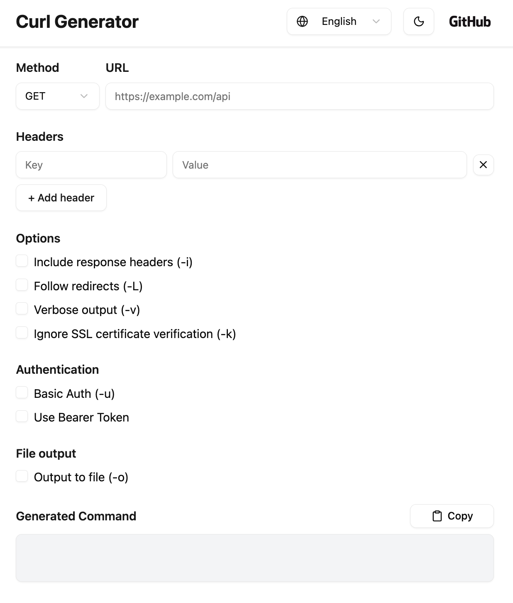

# Curl Generator

[日本語版 README はこちら](/docs/ja/README.md)

App URL: [https://d249wz41volo8p.cloudfront.net/](https://d249wz41volo8p.cloudfront.net/)

## Overview

This application is a tool that **automatically generates curl commands** for sending HTTP requests.
By simply entering the method, URL, headers, and body, the corresponding curl command is generated instantly.

### How to Use

1. Select the **HTTP method** (e.g., GET, POST).
1. Enter the **request URL**.
1. Add **headers, body, or authentication info** as needed.
1. Choose additional options (e.g., `-i`, `-L`, `-v`, `-k`) using checkboxes.
1. The curl command is generated and displayed in real time based on your input.
1. Click the **Copy** button to copy it to your clipboard.

### Use Cases

- Quickly test API requests.
- Generate multiple curl commands for different scenarios.
- Learn and review how to write curl commands and use common options.

### Features

- **Real-time curl command generation** based on input.
- **Common options** can be easily selected with checkboxes.
- **Add or remove multiple headers** dynamically.
- Supports **Basic Authentication** and **Bearer Tokens**.
- **Light / Dark mode switching** supported.
- **Language switching (Japanese / English)** supported.

## Technologies Used

### Frontend

| Category         | Technology                        |
| ---------------- | --------------------------------- |
| Language         | TypeScript                        |
| Library          | React                             |
| Styling          | Tailwind CSS, Shadcn UI           |
| Icons            | lucide-react                      |
| State Management | React Hooks (useState, useEffect) |
| Development Env  | Docker, Docker Compose            |
| Hosting          | S3 + CloudFront                   |

### Backend

None (frontend-only architecture)

## System Architecture

