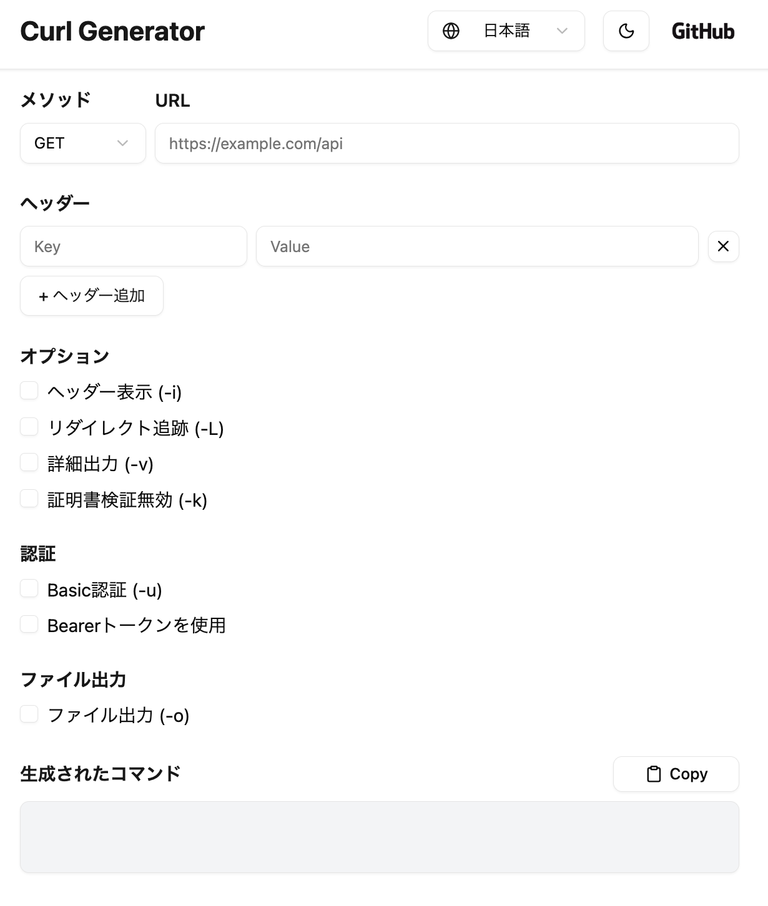

# Curl Generator

[English README is here](/README.md)

アプリ URL: [https://d249wz41volo8p.cloudfront.net/](https://d249wz41volo8p.cloudfront.net/)

## 概要

このアプリは、HTTP リクエストを送信するための **curl コマンドを自動生成**できるツールです。  
メソッド・URL・ヘッダー・ボディなどを入力するだけで、即座にコマンドが生成されます。

### 使い方

1. **HTTP メソッド**（GET, POST など）を選択します。
1. **リクエスト URL** を入力します。
1. 必要に応じて **ヘッダーやボディ、認証情報** を入力します。
1. オプション（例: `-i`, `-L`, `-v`, `-k` など）をチェックボックスで選択します。
1. 入力内容に基づいて、下部にリアルタイムで curl コマンドが生成・表示されます。
1. 「Copy」ボタンでクリップボードにコピーできます。

### 利用シーン

- API リクエストを手軽に試したいとき
- 複数の curl コマンドを作成したいとき
- curl コマンドの書き方、オプションを学習・確認したいとき

### 特徴

- 入力内容に応じて リアルタイムで curl コマンドを生成
- よく使うオプションを チェックボックスで簡単設定
- ヘッダーを複数追加・削除 可能
- Basic 認証・Bearer トークン に対応
- ライト／ダークモード切り替え 対応
- 表示言語（日本語／英語）切り替え 対応

## 使用技術

### フロントエンド

| 分類         | 技術要素                          |
| ------------ | --------------------------------- |
| 言語         | TypeScript                        |
| ライブラリ   | React                             |
| スタイリング | Tailwind CSS, Shadcn UI           |
| アイコン     | lucide-react                      |
| 状態管理     | React Hooks (useState, useEffect) |
| 開発環境     | Docker, Docker Compose            |
| ホスティング | S3 + CloudFront                   |

### バックエンド

なし（フロントエンドのみの構成）

## システム構成図

